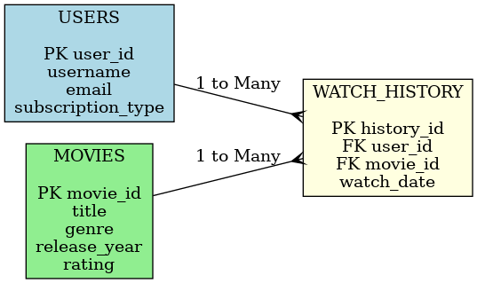

# OTT Platform SQL Project

## Overview
This project demonstrates a **professional SQL-based data analysis** for a fictional OTT (Over-The-Top) streaming platform, similar to Netflix or Prime Video.  
It uses a **small but structured dataset** to showcase skills in **database design, SQL queries, joins, aggregations, and reporting.**  
The project is designed to be shared on GitHub as part of a **portfolio for recruiters and hiring managers**.

---

## Why This Project is Important
- Shows **real-world SQL skills**: database creation, relational design, and insights extraction.  
- Helps demonstrate **data analysis ability** to potential employers.  
- Can be expanded into a **data analytics or Power BI project** later for visualization.

---

## Database Schema & ER Diagram
The database consists of **three tables**:
1. **Users** – Stores user details and subscription types (Free, Premium, VIP).  
2. **Movies** – Contains movie metadata (title, genre, rating, release year).  
3. **Watch_History** – Tracks which user watched which movie and when.

### ER Diagram

---

## Key SQL Features Demonstrated
- **Relational joins** to combine users, movies, and watch history.  
- **Aggregations & reporting** (most watched movies, genres, active users).  
- **Case statements** for classification (viewer type: Heavy, Moderate, Light).  
- **Filtering and sorting** for business insights.

---

## Example Queries
1. **Most Watched Movies**  
2. **Top Active Users (Binge Watchers)**  
3. **Most Popular Genres**  
4. **Viewer Segmentation (Heavy, Moderate, Light)**  
5. **High, Moderate, and Low-Rated Movies**  
6. **Daily Watch Trends**  

The queries are available in the `ott_platform.sql` file.

---

## Why Post on GitHub?
- **Recruiters** can see your **hands-on SQL skills**.  
- Can be used as a **portfolio project** when applying for **Data Analyst, BI Analyst, or SQL Developer roles**.  
- Demonstrates ability to **document and present projects professionally**.

---

## Future Enhancements
- Add **stored procedures & triggers** for automation.  
- Build **Power BI dashboards** to visualize the data (most-watched movies, user trends).  
- Add a **recommendation system** based on viewing patterns.  
- Expand dataset for **realistic, big-data scale analysis**.

---

## How to Use
1. Clone this repository.  
2. Run the `ott_platform.sql` file in MySQL to create the database and tables.  
3. Execute the provided queries for analysis.  
4. View ER Diagram in the repo to understand the database structure.

---

## Author
Created by **Satyam (Jim Jimmy)** to showcase SQL & data analytics skills.
